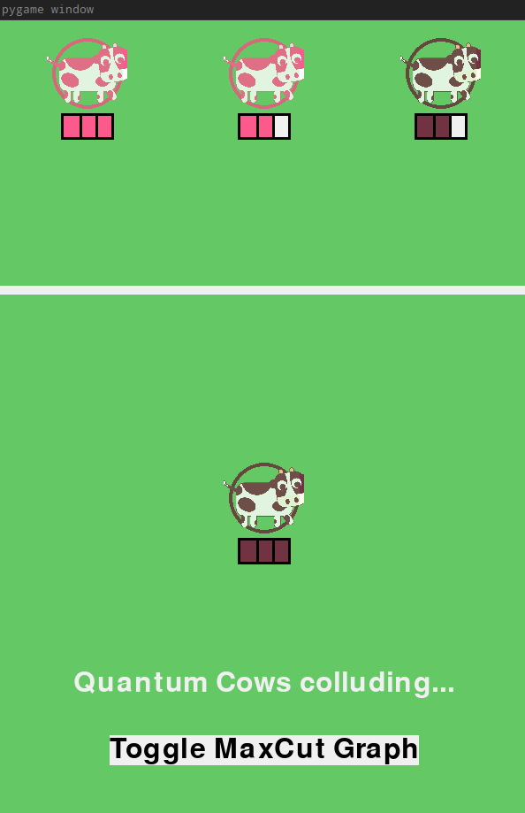

# Womanium-Quantum-Hackathon-2022

Welcome to our repo, we are the **Qordiggers**.

We are:

Joshua Moler - <https://github.com/Joshua-Moler>, joshuamoler00@gmail.com

Caleb Rotello - <https://github.com/CalebRotello>, caleb@rotello.dev (Pitch Presenter)

Bora Basyildiz - <https://github.com/b-basyildiz>, bbasyildiz@mines.edu

Hakan Ayaz - <https://github.com/hakanayaz>, ayazhakann@gmail.com

## Challange is Humans vs. Quantum Computers --> by IBM

Challenge definitions are given by IBM and which is here:

Create a working interactive ‘program’ (it can be a website, game, app, etc.) in which a human user is facing off against a quantum computer. This is broad on purpose - the program can be built in many different ways. Your program should implement strategies that seriously challenge the human player. The implementation must utilize more than just probabilities related to measuring quantum states. You must use Qiskit to program the computer’s gameplay strategy, and as much as possible, the strategy should be implemented with quantum circuits and quantum gates on real quantum hardware (although using the Simulator is understandable given the time limit)

## Solution: **MILQ Simulator**

As a solution we create MILQ simulator which is a party affliation congestion game.

### Game Description

Our game idea comes from the paper that we read which is [On Strong Equilibria in the Max Cut Game
](https://www.researchgate.net/profile/Jerome-Monnot/publication/44241087_On_Strong_Equilibria_in_the_Max_Cut_Game/links/0c96052a841f89f843000000/On-Strong-Equilibria-in-the-Max-Cut-Game.pdf?origin=publication_detail).

As mentioned, our game is defined as a party affiliation congestion game. Specifically, it is a set of cows on a field. The number of cows at the beginning can be changed, giving us a different difficulty level, but we will primarily start with four cows. On the field, we have two separate farms with two cows each. One side has chocolate milk cows, and the other has strawberry milk cows. The player starts as the chocolate milk cow farmer, and the **Quantum AI** starts as a strawberry milk cow farmer. The player's goal is to make all the cows on the field all chocolate milk cows. Moves can be made by strategic breeding and moo-ving cows.

The game has three distinct stages: the moo-ving stage, the breeding stage, and the death stage. These stages repeat until all the cows are all either strawberry or chocolate milk cows. If all the cows are chocolate milk, then the player wins! If all the cows are strawberry milk, the Quantum AI wins!

## Step-by-Step Gameplay Actions

### Moo-ving Cows

First, the player will have the option to move one of their cows to the other farmer's field. Which will be like this in the game.

A player must move one cow they control. All chocolate milk cows are governed by the player, no matter what farm they are on. Thus the player must strategically move their cows so that the chocolate milk cows outbreed the strawberry milk cows (Breeding will explain this in the next section). Similarly, the Quantum AI will also be forced to move one of their strawberry milk cows.

### Breeding

After both players move a respective cow, the breeding process takes place. On each farm, two random cows will choose to breed, and their offspring will be a strawberry or chocolate milk cow, depending on each cow's gene makeup.

### Genes

Each cow has a set of three genes, and all three of those genes can be either brown, pink, or nothing. A cow with the pinkest or brown genes will be a chocolate or strawberry milk cow. If there is a tie, for example, a cow can have a pink, brown, and none gene makeup, and then the cow is randomly selected to be a chocolate or strawberry milk cow.

### Death

The last mechanic in the MILQ Simulator game is the death mechanic. At the end of each breeding stage, one cow from each respective farm dies. The probability of a cow dying is based on age, and it relates to how many turns the cow has been on the board.

### Quantum AI

The controller of the strawberry cows is a Quantum AI. We designed the game through a series of mathematical reductions and QAOA optimizations.

First, our game is defined as a congestion game, which can be reduced to the [Not-all Equal (NAE) SAT problem](https://www.csie.ntu.edu.tw/~lyuu/complexity/2010/20101102.pdf).

We can further reduce the NAE SAT problem to [NAE 3-SAT](https://npcomplete.owu.edu/2014/07/22/not-all-equal-3sat/) and reduce it a final time to the well-studied [Max-Flow problem](https://www.geeksforgeeks.org/max-flow-problem-introduction/) (All reductions are polynomial time).

We then use [QAOA](https://arxiv.org/abs/1411.4028) to find the best solution to the Max-Flow problem, and we use this solution to generate the next move in our congestion game.

Please see the Hackathon_Math.pdf in the Documents folder for a more theoretical explanation.

### Future Possible Work?
